********Sprint 1********

**Cluster Set Up**

1. Launch 3 EC2 machine using Ubuntu 22.04 (base image ami-03c1f788292172a4e / 10 GB) (1 master and 2 worker)
  
  base image used

  

  

2. 🧱Run below commands
   sudo apt update && sudo apt upgrade -y
   
   sudo apt install -y curl bash-completion git apt-transport-https ca-certificates gnupg lsb-release
   
   sudo swapoff -a
   
   sudo sed -i '/swap/d' /etc/fstab
   
3. 📦Install containerd (Applicable for all nodes)
   sudo apt install -y containerd
   
   sudo mkdir -p /etc/containerd
   
   containerd config default | sudo tee /etc/containerd/config.toml

   sudo sed -i 's/SystemdCgroup = false/SystemdCgroup = true/' /etc/containerd/config.toml
   
   sudo systemctl restart containerd

   sudo systemctl enable containerd
   
4. 🧠Kernel Modules + Sysctl (Applicable for all nodes)
   
   cat <<EOF | sudo tee /etc/modules-load.d/k8s.conf

   overlay

   br_netfilter

   EOF

   sudo modprobe overlay
   
   sudo modprobe br_netfilter

   cat <<EOF | sudo tee /etc/sysctl.d/k8s.conf

   net.bridge.bridge-nf-call-iptables  = 1

   net.ipv4.ip_forward                 = 1

   net.bridge.bridge-nf-call-ip6tables = 1

   EOF

   sudo sysctl --system

5. 🔧 Install Kubernetes Components (Applicable for all nodes)
   curl -fsSL https://pkgs.k8s.io/core:/stable:/v1.29/deb/Release.key | \
   gpg --dearmor | sudo tee /etc/apt/keyrings/kubernetes-apt-keyring.gpg > /dev/null

   echo "deb [signed-by=/etc/apt/keyrings/kubernetes-apt-keyring.gpg] https://pkgs.k8s.io/core:/stable:/v1.29/deb/ /" | \
   sudo tee /etc/apt/sources.list.d/kubernetes.list

   sudo apt update
   sudo apt install -y kubelet kubeadm kubectl
   sudo apt-mark hold kubelet kubeadm kubectl

 6. 🚦 **Master Node Initialization**
    sudo kubeadm init --pod-network-cidr=10.244.0.0/16

    Post-init setup:
    mkdir -p $HOME/.kube
    sudo cp -i /etc/kubernetes/admin.conf $HOME/.kube/config
    sudo chown $(id -u):$(id -g) $HOME/.kube/config

 7. 🌐 Pod Network (Flannel CNI)
    kubectl apply -f https://raw.githubusercontent.com/coreos/flannel/master/Documentation/kube-flannel.yml

    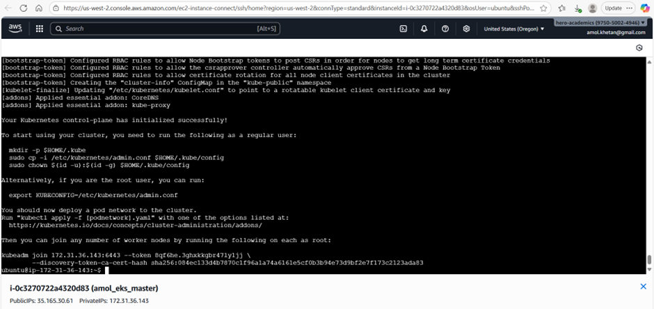

   AMI created for master is ami-07cd7e2b91f9e1923
   

8. **Create and Add Worker Node**
   Repeat all Steps from 1-5 and the run step 8.

  sudo kubeadm join 172.31.36.143:6443 --token 8qf6he.3ghxkkgbr47ly1jj \
  --discovery-token-ca-cert-hash sha256:084ec133d4b7870c1f96a1a74a6161e5cf0b3b94e73d9bf2e7f173c2123ada83

  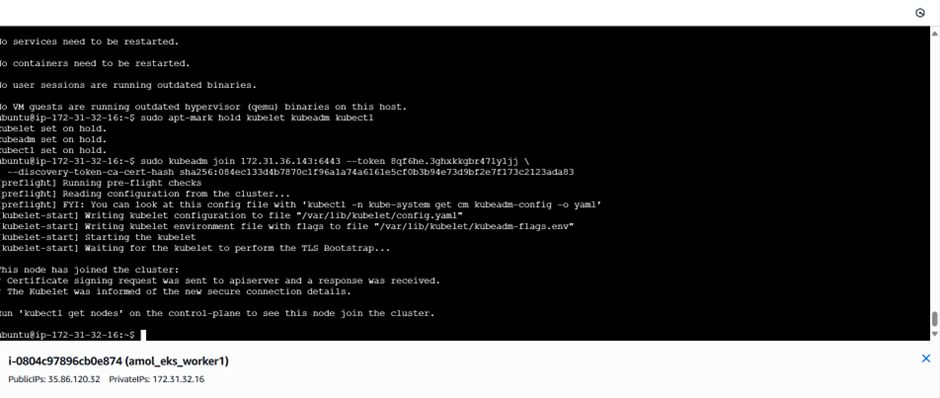

  

AMI **ami-05540aeb6ec68ed3c** created for node which can we used for master or worker, according will need to run init or join comand after ec2 is launched.

   Run on each worker:
   sudo kubeadm join <MASTER_IP>:6443 --token <TOKEN> \
  --discovery-token-ca-cert-hash sha256:<HASH>

   To join master node we need following details:
   - Token
      to create new (run on master): kubeadm token create
     
      to use existing (run on master): kubeadm token list
      
      another sample
      

   - MASTER_IP
       ip a | grep inet **OR** hostname -I
       
       another sample 
       

   - HASH
       openssl x509 -pubkey -in /etc/kubernetes/pki/ca.crt | \
       openssl rsa -pubin -outform der 2>/dev/null | \
       openssl dgst -sha256 -hex | \
       sed 's/^.* //'
       
        another one
      

      Full Command:
     kubeadm join 172.31.32.27:6443 \
     --token kq12ua.jss372be8i7q1p9k \
     --discovery-token-ca-cert-hash sha256:a834f53ad857245d5a1919ff6049542ff7c4a5e651f003992ddd728f264721ef

      Once Joined below are screenshot to show master and worked nodes
      
      

      
      

**Define Folder Structure**

Run **mkdir -p k8s-health-checker/{cmd,pkg,scripts,dashboards,manifests,alerts} && touch k8s-health-checker/{Dockerfile,README.md,go.mod,requirements.txt}**
to create below folder structure:

k8s-health-checker/
├── cmd/                  # Go entry points
├── pkg/                  # Core logic: health checks, healing actions
├── scripts/              # Python scripts for data processing
├── manifests/            # Kubernetes YAMLs
├── dashboards/           # Grafana JSON configs
├── alerts/               # Prometheus alert rules
├── Dockerfile
├── go.mod / requirements.txt
└── README.md

sudo apt install tree

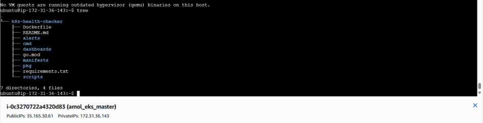

Initialize 
cd ~/k8s-health-checker

git init

**GO SetUp**
sudo apt update
sudo apt install golang-go

Verify using:
which go
go version

Set Up Go Project Directory:
mkdir -p ~/go/src/github.com/amolkhetan/k8s-health-checker
cd ~/go/src/github.com/amolkhetan/k8s-health-checker

Initialize Go Module:
go mod init github.com/your-org/k8s-health-checker

Organize Code Structure
mkdir -p cmd pkg/client
mv main.go cmd/
mv client.go pkg/client/

build Binary:
go mod tidy
go build -o health-checker ./cmd

sudo snap install docker

sudo groupadd docker
sudo usermod -aG docker $USER
newgrp docker

Build Docker File
sudo nano Dockerfile
docker build -t k8s-health-checker .
docker tag k8s-health-checker amolkhetan/k8s-health-checker:latest
docker push amolkhetan/k8s-health-checker:latest

sudo nano k8s-health-checker/manifests/rbac/service-account.yaml
sudo nano k8s-health-checker/manifests/rbac/cluster-role-binding.yaml

kubectl apply -f manifests/rbac/
kubectl apply -f manifests/deployment.yaml
kubectl apply -f manifests/deployment.yaml
kubectl apply -f manifests/deployment.yaml

sudo snap install helm --classic

**Pod Status**

**Install Prometheus**

wget https://github.com/prometheus/prometheus/releases/download/v2.50.1/prometheus-2.50.1.linux-amd64.tar.gz

tar -xvf prometheus-2.50.1.linux-amd64.tar.gz

cd prometheus-2.50.1.linux-amd64

sudo mv prometheus promtool /usr/local/bin/

sudo mkdir -p /etc/prometheus /var/lib/prometheus

sudo cp -r consoles console_libraries /etc/prometheus/

sudo nano /etc/prometheus/prometheus.yml

Note: Scraping will happen based on scrape_configs defined in prometheus.yml

sudo systemctl daemon-reexec
sudo systemctl daemon-reload
sudo systemctl enable prometheus
sudo systemctl start prometheus

**Node Exporter (EC2 Metrics)**
wget https://github.com/prometheus/node_exporter/releases/download/v1.7.0/node_exporter-1.7.0.linux-amd64.tar.gz

tar -xvf node_exporter-1.7.0.linux-amd64.tar.gz

cd node_exporter-1.7.0.linux-amd64

sudo mv node_exporter /usr/local/bin/

sudo nano /etc/systemd/system/node_exporter.service

sudo systemctl daemon-reload
sudo systemctl enable node_exporter
sudo systemctl start node_exporter

Now, install node exporters on all nodes

wget https://github.com/prometheus/node_exporter/releases/download/v1.7.0/node_exporter-1.7.0.linux-amd64.tar.gz
tar -xvf node_exporter-1.7.0.linux-amd64.tar.gz
sudo mv node_exporter-1.7.0.linux-amd64/node_exporter /usr/local/bin/

sudo useradd -rs /bin/false node_exporter

cat <<EOF | sudo tee /etc/systemd/system/node_exporter.service
[Unit]
Description=Node Exporter
After=network.target

[Service]
User=node_exporter
ExecStart=/usr/local/bin/node_exporter

[Install]
WantedBy=default.target
EOF

sudo systemctl daemon-reload
sudo systemctl enable node_exporter
sudo systemctl start node_exporter

Now test Prometheus.

**Alertmanager (Slack Notifications)**

wget https://github.com/prometheus/alertmanager/releases/download/v0.27.0/alertmanager-0.27.0.linux-amd64.tar.gz
tar -xvf alertmanager-0.27.0.linux-amd64.tar.gz
cd alertmanager-0.27.0.linux-amd64
sudo mv alertmanager amtool /usr/local/bin/
sudo mkdir -p /etc/alertmanager /var/lib/alertmanager

sudo nano /etc/alertmanager/alertmanager.yml
sudo nano /etc/systemd/system/alertmanager.service

sudo systemctl daemon-reload
sudo systemctl enable alertmanager
sudo systemctl start alertmanager

Note: 1. Whatever routes you set up in alertmanager.yml, alerts will be routed based on matchers, receivers and severity set
      2. Alerts Rules folder/file needs to be copied in prometheus folder and should be there in prometheus.yml

**Grafana (Dashboard UI)**

sudo apt install -y apt-transport-https software-properties-common
sudo wget -q -O /usr/share/keyrings/grafana.key https://apt.grafana.com/gpg.key
echo "deb [signed-by=/usr/share/keyrings/grafana.key] https://apt.grafana.com stable main" | \

sudo tee /etc/apt/sources.list.d/grafana.list
sudo apt update
sudo apt install grafana

sudo systemctl enable grafana-server
sudo systemctl start grafana-server

URL : http://localhost:9090

**Sprint 2**
Alerts rules were set up in rules folder defined in prometheus.

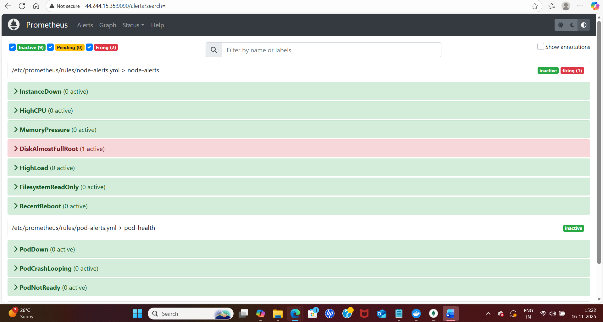

**Sprint 3**

✅ 1. Implement Pod Restart & Rescheduling Based on Health Checks
🔧 A. Use Liveness Probes for Auto-Restart

Update deployment yaml file to add:
livenessProbe:
  httpGet:
    path: /healthz
    port: 8080 #change as per service port
  initialDelaySeconds: 10
  periodSeconds: 30
  failureThreshold: 3
This triggers a container restart if /healthz fails repeatedly.

🔧 B. Use Readiness Probes to Control Traffic
readinessProbe:
  httpGet:
    path: /ready
    port: 8080 #change as per service port
  initialDelaySeconds: 5
  periodSeconds: 10
Prevents traffic until the pod is ready.

✅ 2. Automate Cleanup of Failed Pods
🔧 A. Script to Delete CrashLoopBackOff and Evicted Pods
      File is attached/present in templates
      Run this via cron or systemd timer.

✅ 3. Test Self-Healing in Staging
🔧 A. Simulate Failure
    kubectl exec -n slabai <pod-name> -- kill 1 (or run crashlooping pod)
    This kills the main process, triggering a restart if probes are set.

    Crash-looping pod is induced for testing purpose via crash-pod.yaml
    This was cleaned up by cleanup job deployed via pod-cleanup.yml which runs like at desired interval.

    

    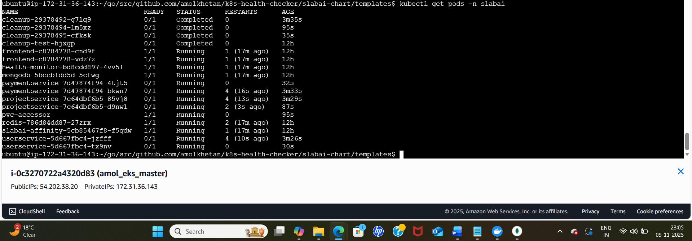
   
    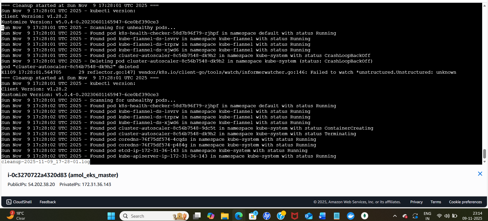

    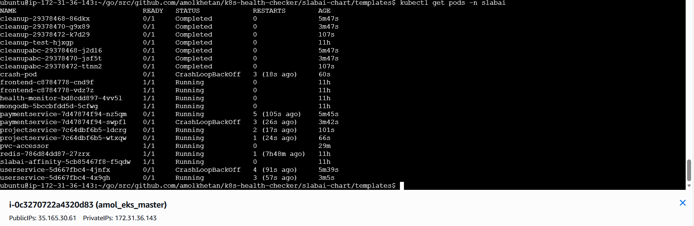

    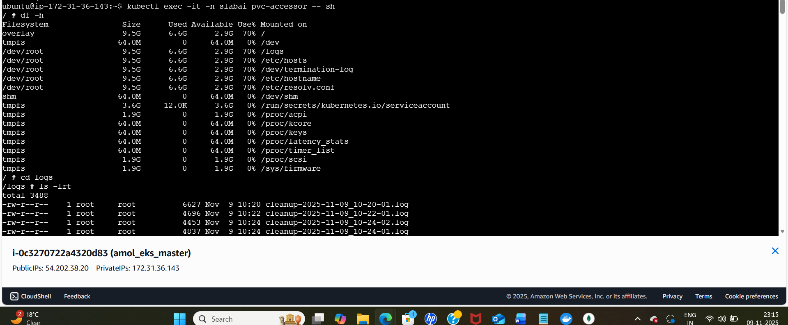

    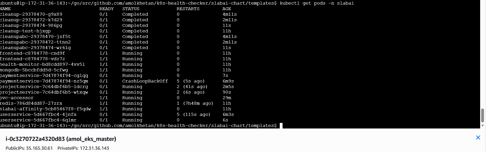

    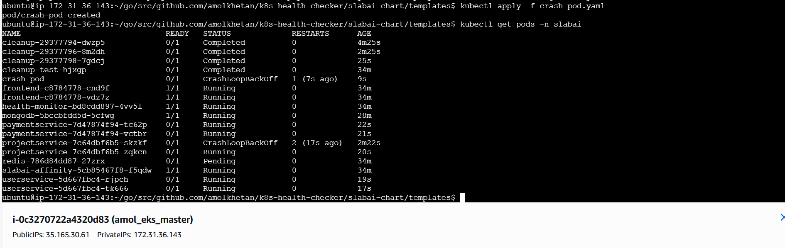
    
    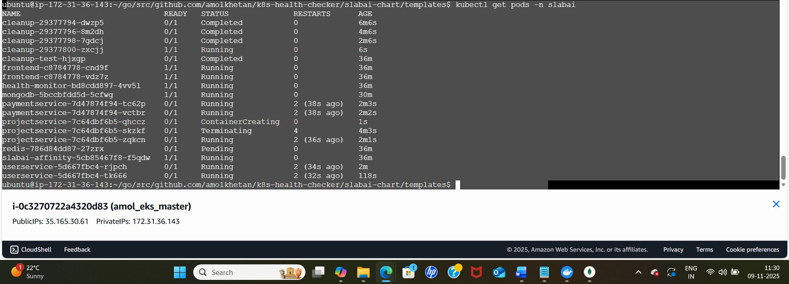    

    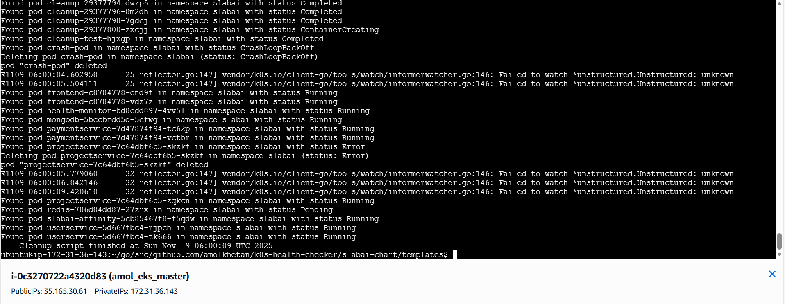
🔧 B. Observe Recovery
    kubectl get pods -n slabai -w
    Watch for pod restart and rescheduling.

✅ 4. Log Actions for Auditing
    Logs of clean activities are being stored on pv. This pv can be accessby pvc accessor.
    kubectl exec -it -n slabai pvc-accessor -- sh
    path is /logs

******🚀 Sprint 4 Execution Plan: Advanced Self-Healing******

****🧩 1. Automatic Node Scaling (Cluster Autoscaler)****

**Goal: Dynamically add/remove nodes based on pending pods and resource pressure.**

⚙️ 1. Enable Node Autoscaling with Cluster Autoscaler

- Install Cluster Autoscaler:

helm repo add autoscaler https://kubernetes.github.io/autoscaler
helm install cluster-autoscaler autoscaler/cluster-autoscaler \
  --namespace kube-system \
  --set cloudProvider=aws \
  --set autoDiscovery.clusterName=<your-cluster-name> \
  --set awsRegion=<your-region>

- Tag your ASG:

k8s.io/cluster-autoscaler/enabled = true
k8s.io/cluster-autoscaler/<your-cluster-name> = owned

- IAM Permissions:
Ensure the node IAM role has permissions for EC2 Auto Scaling (e.g., autoscaling:DescribeAutoScalingGroups, autoscaling:SetDesiredCapacity).

📈 2. Configure Horizontal Pod Autoscaler (HPA)
- Install metrics-server:
kubectl apply -f https://github.com/kubernetes-sigs/metrics-server/releases/latest/download/components.yaml

- Add resource requests to your deployments:
resources:
  requests:
    cpu: "100m"
    memory: "128Mi"

- Create HPA:
kubectl autoscale deployment <your-deployment> \
  --cpu-percent=50 --min=2 --max=10

- Monitor:
kubectl get hpa
kubectl top pods

🧠 3. Implement Resource Balancing
- Pod Anti-Affinity

affinity:
   podAntiAffinity:
     requiredDuringSchedulingIgnoredDuringExecution:
       - labelSelector:
           matchExpressions:
             - key: app
               operator: In
               values:
                 - your-app
         topologyKey: "kubernetes.io/hostname"

- Taints and Tolerations: Use to steer workloads away from overloaded nodes.
- PriorityClasses: Ensure critical pods are scheduled first.
- Eviction Simulation:
kubectl drain <node-name> --ignore-daemonsets --delete-emptydir-data

🔬 4. Simulate Load to Test Autoscaling
kubectl run loadgen --image=busybox -- /bin/sh -c "while true; do wget -q -O- http://<service>; done"

- stress-ng:
kubectl run stress --image=alpine/stress -- stress --cpu 2 --timeout 300s

******🚨 Sprint 5 Execution Plan: Alerting & Notification System******
🧩 1. Install Alertmanager (if not already installed)
This is already installed.

📣 2. Integrate Slack or Microsoft Teams

✅ Slack Integration
1.	Create a Slack Incoming Webhook:
Create Slack account
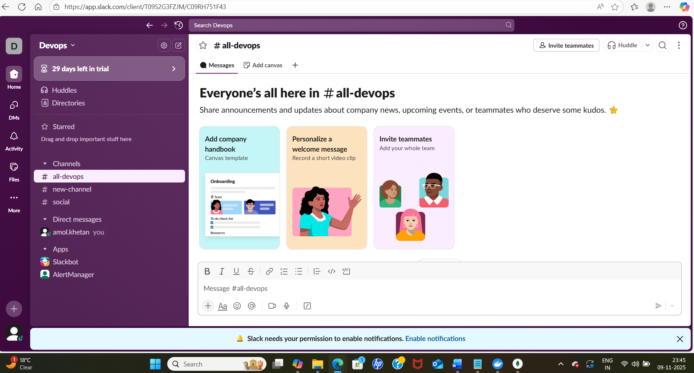

Webhook linked created and copied in alertmanager.yml

🧰 Step-by-Step: Create Slack Webhook URL
✅ 1. Go to Slack App Management
•	Visit: https://api.slack.com/apps
•	Click “Create New App”
•	Choose From scratch
•	Name your app (e.g., AlertmanagerBot) and select your workspace
________________________________________
✅ 2. Enable Incoming Webhooks
•	In the app dashboard, go to Features → Incoming Webhooks
•	Toggle Activate Incoming Webhooks to On
________________________________________
✅ 3. Add a Webhook to a Channel
•	Scroll down and click “Add New Webhook to Workspace”
•	Choose the channel (e.g., #alerts) where you want notifications
•	Click Allow
________________________________________
✅ 4. Copy the Webhook URL
•	After approval, Slack will generate a URL like: 
•	
•	Copy this URL — you'll use it in Alertmanager’s config
________________________________________
✅ 5. Secure and Store It
•	Treat this URL like a secret
•	Store it in a Kubernetes Secret or external vault if needed

2. Restart Alertmanager

3. Test Alerts and Notifications
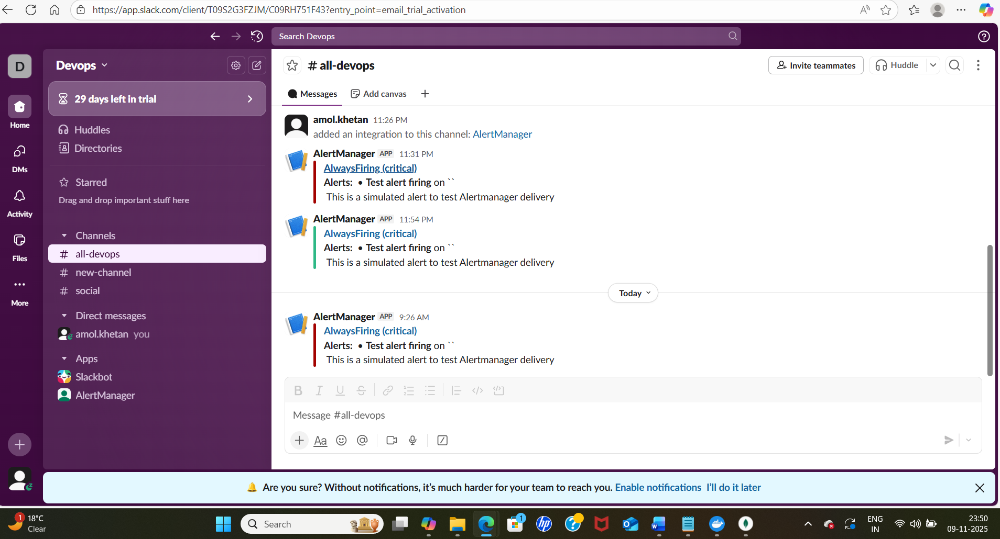

**Sprint 6**

✅ Install Grafana
  Already installed

Accessed via To complete Sprint 6: Web Dashboard and Project Documentation, you’ll deploy Grafana, integrate Prometheus metrics and Alertmanager logs, and document the entire system for real-world readiness. Here's your step-by-step execution plan:

📊 1. Deploy Grafana Dashboard
✅ Install Grafana via Helm:

✅ Get Grafana Login Info:

✅ Port-forward or expose:

Access via: http://<public-ip of master node>:3000

📈 2. Integrate Prometheus & Alertmanager

✅ Add Prometheus as a Data Source:
- Login to Grafana
- Go to Settings → Data Sources → Add data source
- Choose Prometheus
- Set URL to: http://localhost:9090/ (prometheus and Grafana on same host)

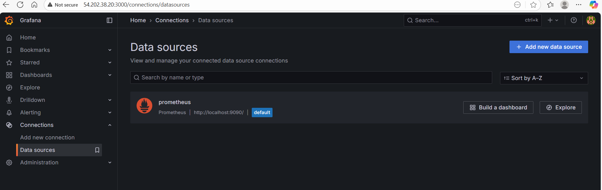

✅ Import Dashboards:
- Go to Dashboards → Import
- Use IDs like:
- 1860: Kubernetes cluster monitoring
- 315: Node Exporter Full
- 11074: Alertmanager

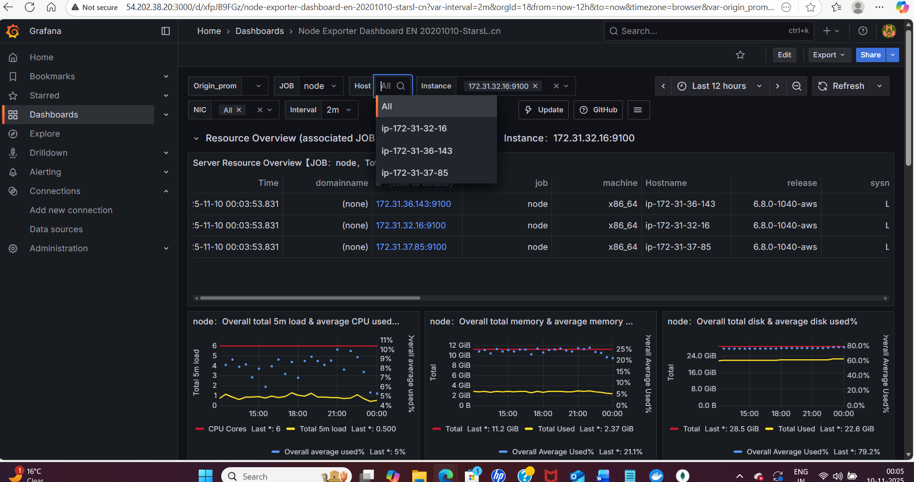

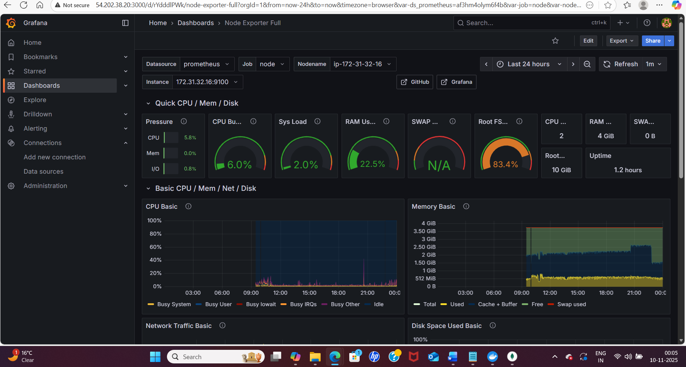

**Areas of Improvment**
1. Use Terraform to provision EC2
2. Ansible to configure EC2 nodes

**Troubleshoting**
1. To check pod issues
   kubectl logs <pod> -n <namespace>

2. To check disk pressure

   kubectl describe node ip-172-31-36-143 | grep -A5 Conditions
   
4. To make some space

   docker container prune -f
   
   docker image prune -a -f
